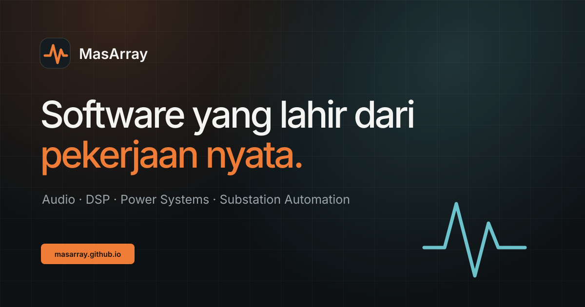

<div align="center">



# MasArray Software Portal

**The official public directory for MasArray engineering, audio DSP, creator, desktop, mobile, and web software.**

[](https://masarray.github.io/)
[](https://github.com/masarray/masarray.github.io/actions/workflows/quality.yml)
[](https://masarray.github.io/)
[](#architecture)

[Open the portal](https://masarray.github.io/) · [Browse MasArray repositories](https://github.com/masarray?tab=repositories) · [Report a portal issue](https://github.com/masarray/masarray.github.io/issues/new/choose)

</div>

## Purpose

`masarray.github.io` is the primary discovery surface for MasArray software. It gives public users one clear place to find product websites, release pages, source repositories, platform information, and project status across two main portfolios:

- **Engineering software:** IEC 61850, IEC 60870, DNP3, protection, process bus, substation automation, testing, evidence, and energy tools.
- **Audio and creator software:** DSP, VST, karaoke, browser audio, OBS, live streaming, desktop, mobile, and web utilities.

The portal is intentionally lightweight. It runs as a static site, loads without a framework, and progressively enriches the software directory from GitHub's public repository API.

## Product experience

- Searchable and filterable software directory.
- Automatic discovery of eligible public MasArray repositories.
- Curated priority and category rules for important products.
- Direct routes to product websites, releases, and source code.
- Dark and light themes with keyboard and reduced-motion support.
- Responsive layouts for desktop, tablet, and mobile.
- SEO metadata, structured data, sitemap, web manifest, social preview, and custom 404 page.
- Built-in fallback catalog when GitHub's API is unavailable or rate-limited.

## Architecture

```text
Browser
  ├─ index.html           semantic content, SEO, structured data
  ├─ styles.css           responsive visual system and themes
  ├─ app.js               directory, search, filters, sorting, fallback
  └─ GitHub public API    current public repository metadata
            │
            └─ fallback catalog when the API cannot be reached
```

No application server, database, analytics SDK, account system, or build-time framework is required. See [`docs/ARCHITECTURE.md`](docs/ARCHITECTURE.md) for the trust boundaries and runtime flow.

## Repository structure

```text
.
├── index.html
├── styles.css
├── app.js
├── 404.html
├── favicon.svg
├── social-preview.svg
├── site.webmanifest
├── robots.txt
├── sitemap.xml
├── .nojekyll
├── tools/
│   └── validate-site.py
├── docs/
│   ├── ARCHITECTURE.md
│   ├── DEPLOYMENT.md
│   └── REPOSITORY_STANDARDS.md
└── .github/
    ├── workflows/quality.yml
    ├── ISSUE_TEMPLATE/
    ├── pull_request_template.md
    └── CODEOWNERS
```

## Local development

No dependency installation is needed.

```bash
python -m http.server 4173
```

Open `http://localhost:4173`.

Run the same repository checks used by CI:

```bash
python tools/validate-site.py
node --check app.js
```

## Quality gate

Every pull request and push to `main` runs the following checks:

- required production files are present;
- HTML metadata, canonical URL, IDs, local assets, and safe external links are valid;
- manifest, sitemap, and robots files are parseable and internally consistent;
- JavaScript syntax is valid;
- the site can be served and its critical assets return successfully.

The workflow uses only official GitHub-maintained setup actions and standard Python, Node.js, and curl tooling.

## Deployment

The production website is served by GitHub Pages from the root of `main`. Deployment and rollback guidance is documented in [`docs/DEPLOYMENT.md`](docs/DEPLOYMENT.md).

The repository includes the Google Search Console verification file. Do not rename or remove it unless verification is intentionally replaced.

## Repository and product boundaries

This repository is the **portal**, not a monorepo for every MasArray product. Product source, binaries, releases, support policy, security scope, and licensing remain authoritative in each product's own repository.

The portal does not grant a blanket license over linked projects. Each linked repository retains its own license or end-user terms. No repository-wide license should be inferred where one is not explicitly published.

## Contributing, support, and security

Read [`CONTRIBUTING.md`](CONTRIBUTING.md) before proposing a change. Portal support boundaries are defined in [`SUPPORT.md`](SUPPORT.md). Report security concerns privately according to [`SECURITY.md`](SECURITY.md), not in a public issue.

---

<div align="center">

**Engineering experience, translated into useful software.**

Maintained by [MasArray](https://github.com/masarray) · Indonesia

</div>
